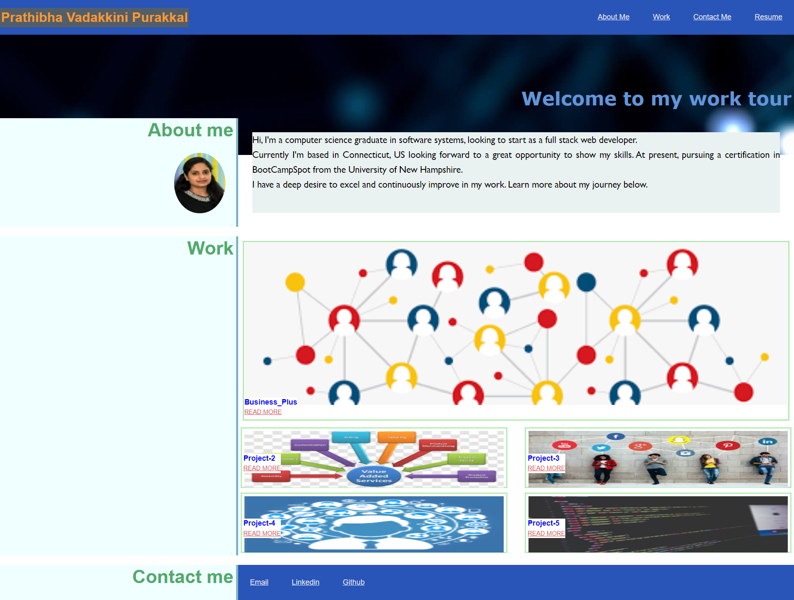

# portfolio-repo

## This repository  is built to potray details about me,and showing my skills n knowledge  using  css and html,it gave me a platform to learn new skills .this portfolio satisfies typical requirements as below


## User Story

```
This portfolio satisfies a potential employee's deployed portfolio of work samples.
```
## Acceptance Criteria

Here are the critical requirements necessary to develop a portfolio that satisfies a typical hiring manager’s needs:

```

WHEN I load their portfolio
THEN I am presented with the developer's name, a recent photo or avatar, and links to sections about them, their work, and how to contact them
WHEN I click one of the links in the navigation
THEN the UI scrolls to the corresponding section
WHEN I click on the link to the section about their work
THEN the UI scrolls to a section with titled images of the developer's applications
WHEN I am presented with the developer's first application
THEN that application's image should be larger in size than the others
WHEN I click on the images of the applications
THEN I am taken to that deployed application
WHEN I resize the page or view the site on various screens and devices
THEN I am presented with a responsive layout that adapts to my viewport
```
## Mock-Up

The following animation shows the web application's appearance and functionality:



* The URL of deployed application:https://programer122223.github.io/portfolio-repo/
* The URL of github repository:https://github.com/PROGRAMER122223/portfolio-repo.git